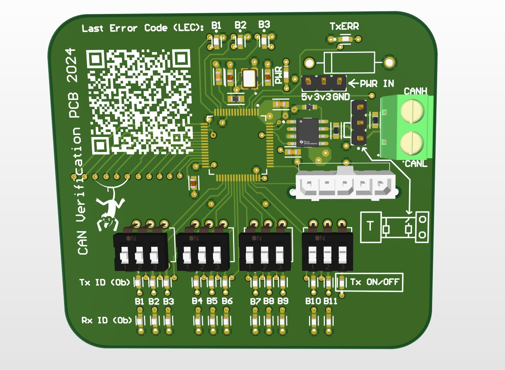

# CAN_Peripheral_Verification_PCB

## Introduction

This is how to use my CAN Peripheral Verification PCB, and how to set up both nodes to test your CAN peripheral.

## Purpose
To easily Verify Transmission and Reception of CAN2.0A CANbus Peripheral for PCB bring up &amp; testing.
Previously to test CAN functionality in RedBack Racing, you would have to find a Nucleo board, CAN transceiver breakoutboard & Jumper wires... not to mention you would have to set up the nucleo board for reception or transmission. This adds an extra failure points during testing. The purpose of this PCB is so that you will only need to set up CAN on YOUR PCB, and configure the CAN reception & transmission ID's through DIP switches on this CAN Verification PCB in order to eliminate extra points of failure and wasted time due to finding components in lab and setting up 2 CAN peripherals.

## Features
- Tx ID (0b): Row representing 11 bit CAN packet Identifier to SEND.
- Rx ID (0b): Row representing 11 bit CAN packet Identifier that HAS BEEN RECIEVED.
- the 12th LED on the Tx ID (0b) row enables or disables continous attempts at CAN transmission. (Avoiding a "bus off" state when powered on without 2 nodes or improper hardware)
- Last Error Code (LEC): 3 bit error code that is referenced in the reference manual (STM32f446ret6).
- TxErr: Displays the occurance of a Transmission Error, more information can be found from the LEC.
- Optional Termination, either can have 2 terminators or 1, depending on your PCB.
- Power through jumper wires (Easily power both PCB's through a Debugger or External PS)
- Baud Rate (1Mhz). (Adjusting the Baud rate will require reflashing Firmware)

### LED States:
- SOLID: 1/Enabled/Occurance
- Off: 0/Disabled/non-event

### LEC Field Values
LEC Field Values: The LEC bits are located in bits [2:0] of the CAN_ESR register.
- 000: No Error
- 001: Stuff Error
- 010: Form Error
- 011: Acknowledgment Error
- 100: Bit recessive Error
- 101: Bit dominant Error
- 110: CRC Error
- 111: Set by software

## Testing Process Overview
Terminology:

- CAN Verification PCB: PCB_A

- User PCB: PCB_B
### Transmission Testing
1. Connect CANbus Lines

2. Configure Termination

3. Set up PCB_B to test Sending CAN packets with an identifier(CAN2.0A). E.g 0x555

4. Power on BOTH PCB's

5. Check Rx ID (0b) LED indicators on PCB_A. E.g 0b10101010101
### Reception Testing
1. Connect CANbus Lines

2. Configure Termination

3. Set up DIP Switches on PCB_A to test Sending CAN packets with an identifier(CAN2.0A). E.g 0b0010101011

4. Power on BOTH PCB's

5. Check status LED on PCB_B, to signify that 0xAB was recieved.

## Setup and Preparation
Setting up and Preparation Example for STM32f446ret6 Custom PCB's.
### Transmission Testing
Connect CANbus Lines:

Connect the CAN_H and CAN_L lines between PCB_A and PCB_B.

Configure Termination:

Use DIP switches on PCB_A to enable or disable termination based on your setup.

Set Up PCB_B:

Configure PCB_B to transmit CAN packets with a chosen identifier (e.g., 0x555 for standard CAN2.0A frames).

Power On Both PCBs:

Ensure both PCBs are powered up (either via debugger or external power).

Verify Reception on PCB_A:

Check the Rx ID LED indicators on PCB_A to confirm that the correct identifier was received (e.g., 0b10101010101).
### Reception Testing
Connect CANbus Lines:

Connect the CAN_H and CAN_L lines between PCB_A and PCB_B.

Configure Termination:

Use DIP switches on PCB_A to configure the appropriate termination.

Set DIP Switches on PCB_A:

Set the DIP switches on PCB_A to transmit CAN packets with the desired identifier (e.g., 0x555).

Power On Both PCBs:

Ensure both PCBs are powered up (either via debugger or external power).

Check Reception on PCB_B:

Check the status LEDs or other indicators on PCB_B to confirm reception of the transmitted identifier (e.g., 0x555).

Setup and Preparation for Testing STM32F446RET6 PCBs

In this section, we’ll walk you through the process of configuring CAN communication for both transmission and reception using STM32CubeIDE.

### Transmission Setup in STM32CubeIDE

Open CubeMX in STM32CubeIDE.

Enable CAN1 Peripheral:

In the Peripherals tab, select CAN1.

Configure CAN TX Pin:

Choose the appropriate GPIO pin for CAN_Tx from the available options (e.g., PA12).

Configure Baud Rate:

Set the baud rate to 1MHz (or your desired rate).

Write CAN Transmission Code:

Use the HAL function HAL_CAN_AddTxMessage() to queue a CAN message for transmission.

Reception Setup in STM32CubeIDE

Enable CAN1 Peripheral:

In the Peripherals tab, select CAN1.

Configure CAN RX Pin:

Choose the appropriate GPIO pin for CAN_Rx from the available options (e.g., PA11).

Set Up Reception Filters:

Configure CAN filters to accept specific identifiers.

Write CAN Reception Code:

Use the HAL function HAL_CAN_GetRxMessage() to retrieve incoming CAN messages.

# Future Improvements
- Addition of built in ST-link functionality which can flash other STM32s with predefined test code using Serial Wire, then once the target STM32 is programmed it starts CAN transmission and reception autotests to test CAN functionality, then logs the feedback via LEDs/sending error messages to a comport/display.

- Complete plug and play system

- Works well when MCU chips and CAN circuitry is standardised

- Difficulties implementing this come from 16 total variations of CAN1_Tx & CAN1_Rx pins, resulting in 16 different firmware images that need to be detected and stored in an external flash module.

